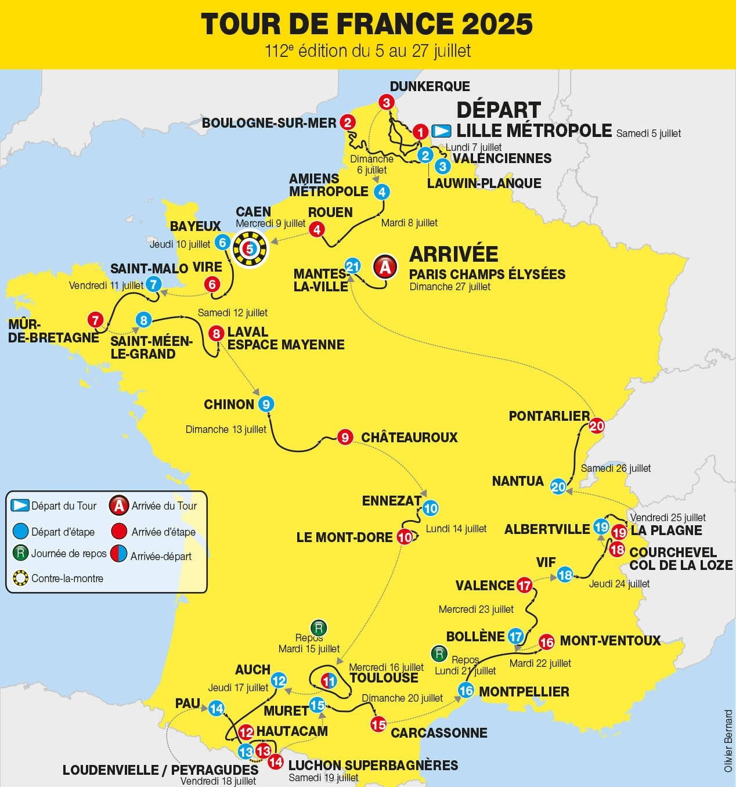
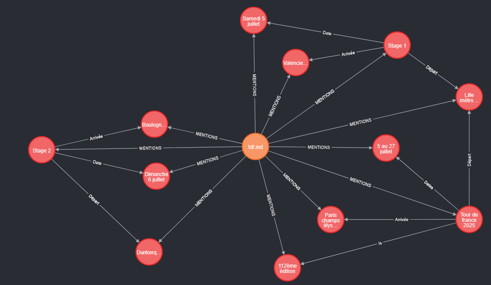
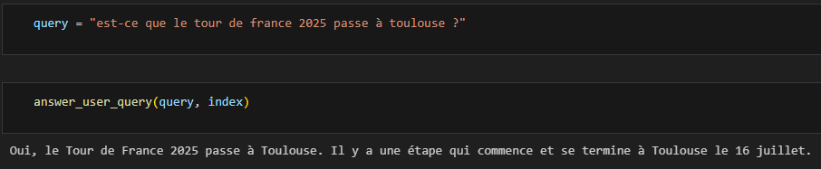

# GraphRAG on the Tour de France 2025 map

## Goal

This repo aims to build a bot able to answer questions about the stages of the Tour de France 2025.

## Building the graph

The raw data used here is the Tour de France 2025 map :

The code uses an LLM to extract information from this map to a markdown file.

Then, we use llama-index to build a knowledge graph from the markdown file and get this neo4j graph :

## Querying the graph

We can then query the graph to ask him a question about the Tour de France 2025 schedule :

Which is correct !
